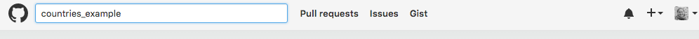

> ## Learning Objectives {.objectives}
>
> * Fork a repository in GitHub

Now, we will see how GitHub can be used as a powerful collaboration tool. To begin, we need to navigate to the countries repository the instructor created during the set up for this lesson. In the search box on the top, search for the name of the repository. 

GitHub allows users to search on different levels. If you are already it in a repository, it will automatically search within that repo. As an indicator, "this repository" will appear in the search bar. Since we want to search all GitHub repositories, click the GitHub icon to reset the search settings.

Once we have located the repository, clicking the title will take us to the repo. There is one folder and a README.md file within the directory. We can explore the files within the GitHub interface. Click on countries and then any of the markdown(.md) files. 

>## README.md{.callout}
>Remember that it is best practice to always have a README.md file within your repository. It should be descriptive so others (or you in a few months) will understand the purpose/structure of your code.

Each of these files contains spaces for information about the population, capital, offical language, and interesting trivia for a specific country. Our goal today is to update a few of the files with information about the designated country. 

Unlike our earlier experience GitHub, we do not own this repository. We can quickly identify the owner by looking at the repostiory name located directly beneath the search bar. The first part of the name is the GitHub user who owns the repository followed by a slash and the repository's name. The owner could be an individual or organizaiton. 

Since we do not own this project, we don't want to make changes directly to this code. Instead, we should make a copy of the code, make our changes, and submit it to the owner. If the owner likes our changes, she can then incorporate it into the original repo. 

In GitHub, making a copy of a repository is called forking. In the top right corner of the page, under your profile picture, there are three buttons. Click on Fork to create a forked copy of the repo. The number beside Fork indicates the number of times the original repo has been forked. 

After you fork the repo, GitHub will automatically redirect you to your forked verison. It should look almost identical. The only change will be the owner has changed and there is a link below the name to original repo. 

Now that we have our own copy, we can start adding information! 

